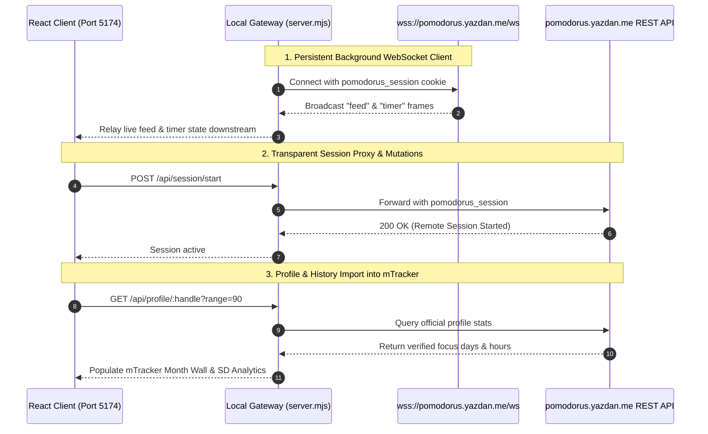
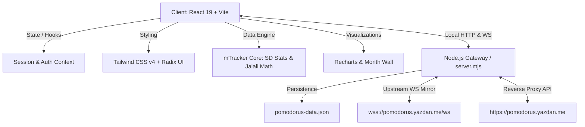

# Pomodorus × mTracker

<p align="center">
  <strong>Unified Focus, Habit Tracking & Rhythm Stability Platform</strong><br>
  <em>سامانه یکپارچه مدیریت تمرکز، پایش عادات و سنجش ثبات ریتم روزانه</em>
</p>

<p align="center">
  <a href="#english"></a>
  <a href="#فارسی"></a>
  <a href="https://github.com/yazdanctx/pomodorus"></a>
  <a href="https://github.com/moein8668-git/mTracker"></a>
  
  
  
  
  
</p>

---

<a name="english"></a>
## English

### 1. Overview & Philosophy

**Pomodorus × mTracker** is a unified productivity environment that fuses execution with longitudinal habit analytics. 

Productivity workflows frequently break down into two disconnected silos:
1. **Real-time deep work sessions** (Pomodoro timers) that lack context on historical momentum and daily target consistency.
2. **Habit and habit-tracking tools** (trackers and spreadsheets) that record whether a goal was met, but do not provide the distraction-free environment to execute the work itself.

This project bridges both worlds into a single, cohesive dashboard:
- It borrows the minimal, zero-distraction Pomodoro engine, ambient workspace, and live concurrent focus presence from **[Pomodorus](https://github.com/yazdanctx/pomodorus)** by [Yazdan](https://github.com/yazdanctx).
- It integrates the statistical discipline, volatility metrics (standard deviation analysis), task scheduling, and Jalali calendar stability from **[mTracker](https://github.com/moein8668-git/mTracker)** by [Moein](https://github.com/moein8668-git).

The result is an ultra-focused interface where you define your tasks, schedule targets, track your statistical rhythm stability, and trigger focused work sessions without switching apps.

---

### 2. Key Features

- **⏱️ Minimalist Pomodoro Focus Engine**
  - Configurable focus intervals, short breaks, and long breaks with cycle indicators.
  - Ambient backdrops and audio cues designed to maintain immersion without visual clutter.
  - Server-skew corrected clock ensuring synchronization across devices and tabs.
  - Live community presence feed showing concurrent focus sessions.

- **📊 Habit Tracking & Task Rhythm (mTracker Integration)**
  - Manage daily and weekly goals with customizable target daily hours per task.
  - Schedule tasks with frequency rules (e.g., 7 days/week, 5 days/week, or unscheduled).
  - Color-coded badges, task notes, and archiving capabilities for finished or paused habits.

- **📈 Volatility & Standard Deviation (SD) Analytics**
  - Go beyond simple streaks: measures work regularity using Standard Deviation ($SD$) and Coefficient of Variation ($CV$).
  - Instant behavioral status indicator:
    - `ثبات` (**Stable / OK**): Low volatility, consistent execution over time.
    - `نوسانی` (**Volatile**): Irregular bursts and inconsistent effort.
    - `بدون داده` (**No Data**): Insufficient data points.
  - Active day ratios, streak counters, historical peak day detection, and target completion percentages.

- **🗓️ Full Jalali (Persian) Calendar & Timeline Support**
  - Native Solar Hijri / Jalali calendar calculation with accurate leap-year handling.
  - **Month Wall (`دیوار ماه`)**: High-density grid visualization of every day in the month with color-scaled hour intensity.
  - **Rhythm Bar Chart (`نمودار ریتم`)**: Visualizes hour distributions against standard deviation threshold bounds.
  - Built-in Jalali date picker and Persian number formatting (`fa-IR`).

- **💾 Data Portability & Upstream Synchronization**
  - Fully local-first persistent storage (`localStorage` & local JSON database).
  - One-click JSON export and import for hassle-free data backups.
  - Built-in synchronization bridge to sync focus time and profile stats with upstream Pomodorus accounts (`pomodorus.yazdan.me`).

- **🖤 Razor-Sharp Minimalist Design**
  - Pure monochrome aesthetic with strict zero border-radius (`--radius: 0rem`).
  - Typography rendered with the beautiful Persian font **Vazirmatn**.
  - Fully responsive: constrained centered column on desktop (`max-w-xl`), flush borderless layout on mobile devices.

---

### 3. Upstream Live Synchronization (How It Works)

This project features a live, bi-directional upstream synchronization bridge with the official **[pomodorus.yazdan.me](https://pomodorus.yazdan.me)** production server. You can run this application locally while maintaining a real-time connection to your live account, stats, and timer.


#### 🚀 Quick Guide: How to Connect & Sync in 30 Seconds

You can connect your account using either of two simple methods:

##### Option A: Instant 1-Click Sync (Read-Only Mirroring — No Password or Cookie Needed!)
1. Launch the app and open [http://localhost:5174](http://localhost:5174).
2. Click the handle badge in the top navigation bar (e.g. `@anoush` or `@username`).
3. Under **1. Upstream Handle**, type your username on [pomodorus.yazdan.me](https://pomodorus.yazdan.me) and click **Save Username (ذخیره نام کاربری)**.
4. **Done!** The app immediately connects to the upstream WebSocket, streams your live timer status, and allows you to import your 90-day focus history in the `/data` tab.

##### Option B: Full Two-Way Sync (Control Timer & Register Pomodoros to Production)
If you want focus sessions started on localhost to officially count toward your profile on `pomodorus.yazdan.me`:
1. Log in to [pomodorus.yazdan.me](https://pomodorus.yazdan.me) in your browser.
2. Press <kbd>F12</kbd> to open DevTools, go to **Application** (Chrome/Edge) or **Storage** (Firefox) → **Cookies** → `https://pomodorus.yazdan.me`.
3. Copy the value of the `pomodorus_session` cookie.
4. In your local app, open the sync modal, paste the cookie into **2. Two-Way Control**, and click **Verify & Connect (ثبت و احراز)**.
   *(Smart parsing automatically trims and cleans the cookie if you copied the full header).*
5. **You're all set!** Any timer you start, pause, or complete locally now syncs live to the production cloud.

*(Pro Tip: You can also pre-configure your setup via environment variables: `UPSTREAM_HANDLE="your_username"` and `UPSTREAM_SESSION_COOKIE="your_cookie"`).*

#### How the Sync Architecture Operates:

1. **Persistent Upstream WebSocket Client (`wss://pomodorus.yazdan.me/ws`)**:
   - The local backend (`server.mjs`) initializes an outbound WebSocket connection directly to Yazdan's production server upon startup.
   - It streams the global live feed (`frame.type === "feed"`), allowing your local UI to see who is currently focusing across the entire global community.
   - It watches the configured handle (e.g., `anoush`). When a session starts or finishes on the live website, the local backend immediately mirrors that session state (`upstreamLiveSession`) and relays it to your browser.
   - When authenticated, it receives authoritative server-clock timer frames (`frame.type === "timer"`) directly from production, ensuring zero clock skew.
   - **Auto-Reconnect Loop**: If network drops occur, the gateway automatically backs off and reconnects within 4 seconds without restarting the app.

2. **Transparent Reverse Proxy for Mutations**:
   - When configured with your `pomodorus_session` cookie (via the UI modal or `UPSTREAM_SESSION_COOKIE`), all write actions are forwarded seamlessly:
     - Starting a session: `/api/session/start`
     - Ending, confirming, or resetting: `/api/session/confirm`, `/api/session/stop`
     - Category management: `/api/categories`
     - Interval configuration: `/api/intervals`
   - Because mutations execute directly against the production database, any pomodoro completed in this local client is immediately credited to your official profile on `pomodorus.yazdan.me`!

3. **In-App Authentication & Cookie Capture**:
   - Clicking the status badge in the navigation bar opens the **Upstream Sync Modal**.
   - You can enter your email to receive an official 6-digit OTP code directly from `pomodorus.yazdan.me`.
   - When verified, the local server captures the incoming `Set-Cookie` (`pomodorus_session`) header and saves it to `upstream-config.json`, keeping you authenticated across restarts.
   - Alternatively, you can copy your cookie directly from DevTools (`Application > Cookies > pomodorus_session`) and paste it into the modal.

4. **History & Analytics Integration (mTracker Bridge)**:
   - On the `/data` page, the application pulls your remote 90-day focus logs via `/api/profile/:handle?range=90`.
   - These official focus sessions are then imported into mTracker’s calculation engine, driving the Jalali Month Wall, daily time breakdown, and Standard Deviation ($SD$) volatility scoring.

---

### 4. Architecture & Tech Stack



- **Frontend**:
  - **Framework**: React 19 (SPA with React Router v7)
  - **Language**: TypeScript 5.9
  - **Styling**: Tailwind CSS v4, Lucide Icons, Radix UI primitives, Sonner toasts
  - **Charting**: Recharts & custom SVG Month Wall
  - **Typography**: Vazirmatn font family with Persian digit localization
- **Backend & Gateway**:
  - **Server**: Node.js HTTP/WebSocket server (`server.mjs`)
  - **Storage**: Persistent JSON database (`pomodorus-data.json`) and client-side `localStorage`
  - **Real-Time Synchronization**: Upstream WebSocket listener and REST reverse proxy

---

### 5. Quick Start & Installation

#### Prerequisites
- **Node.js**: v20.0.0 or later (or [Bun](https://bun.sh))
- **Package Manager**: `npm`, `pnpm`, or `bun`

#### Step-by-Step Setup

1. **Clone the repository:**
   ```bash
   git clone https://github.com/yazdanctx/pomodorus.git
   cd pomodorus
   ```

2. **Install root and client dependencies:**
   ```bash
   # Install root server dependencies
   npm install

   # Install client dependencies
   cd client
   npm install
   cd ..
   ```

3. **Build the client bundle:**
   ```bash
   npm run build
   ```

4. **Start the local server:**
   ```bash
   npm run dev
   ```

5. **Open the application:**
   Navigate to [http://localhost:5174](http://localhost:5174) in your browser.

#### Environment Variables (Optional)

You can customize runtime ports and options using environment variables:

| Variable | Default | Description |
| :--- | :--- | :--- |
| `PORT` | `5174` | Port for the Node.js API and static server |
| `NODE_ENV` | `development` | Environment mode (`development` or `production`) |
| `UPSTREAM_SESSION_COOKIE` | `""` | Optional `pomodorus_session` cookie for authenticated live sync |

---

### 6. Application Navigation

| Route | Section | Description |
| :--- | :--- | :--- |
| `/` | **Landing** | Introduction, philosophy, and quick launch |
| `/app` | **تایمر (Timer)** | Pomodoro focus sessions, ambient backdrops, live feed |
| `/today` | **استمرار (Rhythm)** | Today's progress, SD stability status, streak analytics |
| `/daily` | **روزانه (Daily)** | Daily time entries, task breakdown, manual logging |
| `/report` | **گزارش (Report)** | Month Wall (`دیوار ماه`), rhythm distribution charts |
| `/tasks` | **تسک‌ها (Tasks)** | Create, schedule, edit, colorize, and archive habits |
| `/data` | **داده‌ها (Data)** | JSON backup/restore, upstream sync modal |

---

<a name="فارسی"></a>
## فارسی (Persian)

### ۱. معرفی و فلسفه پروژه

**پومودوروس × ام‌ترکر (Pomodorus × mTracker)** یک محیط کاری یکپارچه برای مدیریت بهره‌وری فردی است که اجرای عمیق را به پایش علمی عادات پیوند می‌زند.

در روش‌های مرسوم مدیریت زمان، معمولاً دو ابزار جداگانه وجود دارد:
1. **تایمرهای فوکوس و پومودورو:** ابزارهایی عالی برای غرقگی در کار بدون حواس‌پرتی، اما بدون داشتن تصویر کلان از استمرار و تاریخچه پیشرفت روزها.
2. **ابزارهای ثبت عادت (Habit Trackers):** برنامه‌هایی برای ثبت انجام شدن یا نشدن اهداف، بدون آنکه بستری برای خودِ اجرای کار فراهم کنند.

این پروژه این دو نگاه را در یک ساختار یکنواخت و زیبا به هم متصل کرده است:
- **موتور تمرکز و غرقگی:** برگرفته از پروژه مینیمال **[Pomodorus](https://github.com/yazdanctx/pomodorus)** اثر [یزدان](https://github.com/yazdanctx)؛ شامل تایمر صفر-حواس‌پرتی پومودورو، پس‌زمینه‌های اتمسفریک و فید زنده‌ی همکاران در حال کار.
- **پایش عادات و سنجش ثبات آماری:** برگرفته از ایده و منطق آماری **[mTracker](https://github.com/moein8668-git/mTracker)** اثر [معین](https://github.com/moein8668-git)؛ شامل محاسبه انحراف معیار ($SD$)، وضعیت نوسان ریتم کاری، تقویم جلالی و ثبت دقیق ساعات اهداف.

حاصل این ترکیب، محیطی آرام، متمرکز و یکپارچه است که در آن اهداف خود را مشخص می‌کنید، میزان نوسان و استمرار خود را می‌سنجید و همان‌جا تایمر تمرکز را استارت می‌زنید.

---

### ۲. قابلیت‌های کلیدی

- **⏱️ تایمر تمرکز پومودورو با دقت بالا**
  - چرخه‌های استاندارد کار عمیق، استراحت کوتاه و استراحت بلند به همراه نشانگر بصری چرخه‌ها.
  - پس‌زمینه‌های بصری ملایم و هشدارهای صوتی برای حفظ آرامش و تمرکز.
  - همگام‌سازی زمانی سمت سرور برای جلوگیری از خطای ساعت سیستم کاربر.
  - فید زنده‌ی کاربران در حال فوکوس برای ایجاد حس همراهی جمعی.

- **📊 پایش عادات و مدیریت تسک‌ها (منطق mTracker)**
  - تعریف تسک‌ها با هدف ساعتی روزانه (Target Hours).
  - برنامه‌ریزی روزهای کاری (هفتگی، ۵ روز در هفته یا آزاد).
  - برچسب‌های رنگی، یادداشت‌نویسی برای لاگ‌ها و امکان بایگانی کردن تسک‌های پایان‌یافته.

- **📈 تحلیل ثبات آماری و شاخص انحراف معیار (SD)**
  - فراتر رفتن از شمارش ساده‌ی روزها (Streak) با سنجش علمی پایداری رفتار کاری:
    - **ثبات (OK):** انحراف معیار پایین و توزیع متعادل کار در طول روزها.
    - **نوسانی (Volatile):** تغییرات ناگهانی و نامنظم در حجم کارکرد روزانه.
    - **بدون داده (No Data):** ناکافی بودن تعداد روزهای ثبت‌شده.
  - درصد تحقق هدف، ثبت رکورد بیشترین ساعت کار در روز، و نسبت روزهای فعال به کل روزها.

- **🗓️ تقویم خورشیدی و گاه‌شمار ماهانه**
  - پشتیبانی کامل و بومی از گاه‌شمار جلالی با محاسبه دقیق سال‌های کبیسه.
  - **دیوار ماه (Month Wall):** ماتریس بصری کامل روزهای ماه به همراه طیف رنگی متناسب با ساعت کارکرد.
  - **نمودار ریتم (Rhythm Bar Chart):** نمایش ستونی توزیع کار روزانه در مقایسه با مرز انحراف معیار.
  - فرمت‌بندی اعداد به صورت فارسی (`fa-IR`) و تقویم انتخاب تاریخ شمسی.

- **💾 استقلال داده‌ها و همگام‌سازی**
  - معماری آفلاین-محور و ذخیره‌سازی ابری محلی (JSON Storage + LocalStorage).
  - خروجی و ورودی گرفتن سریع فایل JSON جهت بکاپ‌گیری امن.
  - قابلیت سینک زنده با حساب کاربری سرور اصلی پومودوروس (`pomodorus.yazdan.me`).

- **🖤 طراحی مینیمال، صریح و بدون حاشیه**
  - استایل تماماً مونوکروم با شعاع زاویه صفر (`--radius: 0rem`).
  - تایپوگرافی چشم‌نواز با فونت استاندارد **وزیرمتن (Vazirmatn)**.
  - طراحی واکنش‌گرا: عرض استاندارد در دسکتاپ (`max-w-xl`) و چیدمان تمام‌صفحه و تمیز در موبایل.

---

### ۳. سازوکار اتصال و همگام‌سازی زنده با سرور اصلی (Upstream Sync)

این پروژه مجهز به یک پل ارتباطی زنده و دوطرفه با سرور نسخه رسمی **[pomodorus.yazdan.me](https://pomodorus.yazdan.me)** است؛ به این معنا که می‌توانید برنامه را به صورت لوکال اجرا کنید، در حالی که تایمر، وضعیت آنلاین و لاگ‌های تمرکز شما مستقیماً با حساب رسمی‌تان روی سرور یزدان سینک است.
#### 🚀 راهنمای سریع: چگونه در ۳۰ ثانیه حساب خود را وصل و همگام کنیم؟

شما به دو روش بسیار آسان می‌توانید برنامه را به حساب خود در سرور اصلی وصل کنید:

##### روش اول: اتصال سریع با نام کاربری (فقط‌خواندنی — بدون نیاز به رمز یا کوکی!)
۱. برنامه را اجرا کرده و باز کنید ([http://localhost:5174](http://localhost:5174)).
۲. در نوار ناوبری بالای صفحه، روی دکمه نام کاربری (مثلاً `@anoush` یا `@کاربر`) کلیک کنید.
۳. در بخش **«۱. نام کاربری در سرور اصلی»**، یوزرنیم خود در [pomodorus.yazdan.me](https://pomodorus.yazdan.me) را وارد کرده و دکمه **«ذخیره نام کاربری»** را بزنید.
۴. **تمام!** وضعیت زنده تایمر شما و فید آنلاین از سرور اصلی بازتاب داده می‌شود و می‌توانید در بخش **داده‌ها** (`/data`) سوابق ۹۰ روزه خود را با یک کلیک دریافت کنید.

##### روش دوم: اتصال کامل دوطرفه (شروع، تایید و ثبت پومودورو روی سرور اصلی)
اگر می‌خواهید پومودوروهایی که روی سیستم خود ثبت می‌کنید، مستقیماً در دیتابیس سرور اصلی و پروفایل ابری شما ذخیره شوند:
۱. در مرورگر وارد سایت [pomodorus.yazdan.me](https://pomodorus.yazdan.me) شوید و لاگین کنید.
۲. کلید <kbd>F12</kbd> را بزنید تا DevTools باز شود. به تب **Application** (در Chrome/Edge) یا **Storage** (در Firefox) بروید و از بخش **Cookies**، دامنه `https://pomodorus.yazdan.me` را انتخاب کنید.
۳. مقدار ستون Value در سطر **`pomodorus_session`** را کپی کنید.
۴. در پنجره همگام‌سازی این برنامه، مقدار را در بخش **«۲. اتصال دوطرفه»** پیست کرده و دکمه **«ثبت و احراز»** را بزنید.
   *(سیستم هوشمند برنامه در صورت کپی شدن کل هدر، پیشوندهای اضافی را به صورت خودکار پاکسازی می‌کند).*
۵. **تبریک!** از این پس هر تایمری که در لوکال استارت بزنید یا پومودورویی را کامل کنید، در حساب رسمی شما روی سرور یزدان ثبت خواهد شد.

*(نکته: می‌توانید این مقادیر را به صورت دائمی در فایل محیطی با متغیرهای `UPSTREAM_HANDLE` و `UPSTREAM_SESSION_COOKIE` نیز تعیین کنید).*

#### سازوکار فنی اتصال و نحوه کارکرد:

۱. **کلاینت پایدار وب‌سوکت سمت سرور (`wss://pomodorus.yazdan.me/ws`):**
   - سرور محلی پروژه (`server.mjs`) به محض اجرا، یک کلاینت وب‌سوکت پایدار به سمت سرور اصلی یزدان باز می‌کند.
   - **پخش زنده فید سراسری (`feed`):** فید تمام کاربران فعال در سطح سرور اصلی دریافت شده و در فید آنلاین فرانت‌اند لوکال نمایش داده می‌شود.
   - **پایش و انعکاس وضعیت کاربر (`upstreamLiveSession`):** سیستم یوزرنیم هدف (به طور پیش‌فرض `anoush`) را تحت نظر می‌گیرد. به محض اینکه سشنی در وب‌سایت اصلی استارت بخورد، سرور محلی پیام را دریافت کرده و وضعیت زنده تایمر را به مرورگر محلی شما مخابره می‌کند.
   - **زمان‌سنجی معتبر سرور (`timer`):** در وضعیت لاگین، کلاینت وب‌سوکت پیام‌های رسمی تایمر سرور را تحویل گرفته و ساعت را بدون کوچک‌ترین خطای تایم‌زون یا ناهماهنگی زمانی سینک نگه می‌دارد.
   - **مکانیزم اتصال مجدد خودکار (Auto-Reconnect):** در صورت بروز هرگونه قطعی در شبکه، کلاینت به طور خودکار در فواصل ۴ ثانیه‌ای برای برقراری مجدد اتصال تلاش می‌کند.

۲. **پروکسی معکوس شفاف برای تراکنش‌ها و ثبت تایمر (Reverse Proxy):**
   - با تنظیم کوکی سشن (`pomodorus_session`) از طریق پنجره پاپ‌آپ داخل برنامه یا متغیر `UPSTREAM_SESSION_COOKIE`، تمامی درخواست‌های نوشتن به سرور اصلی فوروارد می‌شوند:
     - شروع سشن تمرکز (`POST /api/session/start`)
     - اتمام، تایید و ثبت نهایی پومودورو (`POST /api/session/confirm`)
     - توقف یا ریست تایمر (`POST /api/session/stop`)
     - دریافت و ویرایش دسته‌بندی‌ها و تنظیمات اینتروال‌ها (`/api/categories`, `/api/intervals`)
   - به همین دلیل، هر فوکوس و پومودورویی که در این نسخه لوکال ثبت کنید، مستقیماً و بلادرنگ در دیتابیس رسمی یزدان و روی پروفایل عمومی شما در `pomodorus.yazdan.me` ثبت خواهد شد.

۳. **ورود مستقیم و دریافت خودکار کوکی از داخل برنامه:**
   - با کلیک روی نشان سبز رنگ در نوار ناوبری بالا، پنجره **«همگام‌سازی زنده» (Upstream Sync Modal)** باز می‌شود.
   - می‌توانید با وارد کردن ایمیل، کد ۶ رقمی ارسالی از سرور رسمی را وارد کنید؛ سرور محلی هدر `Set-Cookie` دریافتی را استخراج کرده و در فایل `upstream-config.json` ذخیره می‌کند.
   - همچنین کاربر می‌تواند کوکی `pomodorus_session` را مستقیماً از تب Application > Cookies در DevTools مرورگر کپی کرده و در کادر مربوطه قرار دهد.

۴. **پل انتقال تاریخچه و داده‌ها به موتور ام‌ترکر (mTracker Bridge):**
   - در بخش «داده‌ها» (`/data`)، امکان فراخوانی تاریخچه ۹۰ روز گذشته پروفایل رسمی از طریق `/api/profile/:handle?range=90` فراهم شده است.
   - با این همگام‌سازی، کارکردهای ثبت‌شده در پومودوروس به دیتابیس ام‌ترکر منتقل شده و جهت محاسبه شاخص انحراف معیار ($SD$)، پایداری استمرار و پر کردن سلول‌های دیوار ماه جلالی مورد استفاده قرار می‌گیرند.

---

### ۴. پشته فنی و معماری

- **بخش کلاینت (Client):**
  - **فریم‌ورک:** React 19 به همراه React Router v7
  - **زبان:** TypeScript 5.9
  - **استایل‌دهی:** Tailwind CSS v4، کامپوننت‌های Radix UI و آیکون‌های Lucide
  - **رسم نمودار:** Recharts و ماتریس اختصاصی SVG برای دیوار ماه
  - **تایپوگرافی و زبان:** فونت وزیرمتن و رابط کاربری کاملاً راست‌به‌چپ (RTL)
- **بخش سرور و درگاه (Backend & Gateway):**
  - **ران‌تایم:** Node.js (ماژول `server.mjs`)
  - **ذخیره‌سازی:** دیتابیس فایل‌محور ساخت‌یافته (`pomodorus-data.json`)
  - **ارتباط زنده و سینک:** وب‌سوکت دوطرفه محلی و بالادستی + پروکسی معکوس REST API

---

### ۵. راه‌اندازی و اجرای محلی

#### پیش‌نیازها
- نصب بودن **Node.js** (نسخه ۲۰ یا بالاتر) یا **Bun**
- یک مدیر بسته مانند `npm`، `pnpm` یا `bun`

#### مراحل نصب و اجرا

۱. **دریافت مخزن:**
   ```bash
   git clone https://github.com/yazdanctx/pomodorus.git
   cd pomodorus
   ```

۲. **نصب وابستگی‌ها:**
   ```bash
   # نصب پکیج‌های ریشه
   npm install

   # نصب پکیج‌های فرانت‌اند
   cd client
   npm install
   cd ..
   ```

۳. **بیلد گرفتن از فرانت‌اند:**
   ```bash
   npm run build
   ```

۴. **اجرای سرور توسعه:**
   ```bash
   npm run dev
   ```

۵. **مشاهده در مرورگر:**
   آدرس [http://localhost:5174](http://localhost:5174) را باز کنید.

---

### ۶. ساختار بخش‌های برنامه
| مسیر | بخش | کاربرد |
| :--- | :--- | :--- |
| `/` | **صفحه فرود** | معرفی، فلسفه پروژه و ورود سریع |
| `/app` | **تایمر** | پومودورو، انتخاب دسته‌بندی، فید آنلاین و پس‌زمینه‌های فوکوس |
| `/today` | **استمرار** | بررسی وضعیت امروز، شاخص ثبات ریتم (SD) و زنجیره روزها |
| `/daily` | **روزانه** | ثبت و ویرایش لاگ کارکرد روزانه به تفکیک تسک‌ها |
| `/report` | **گزارش** | ماتریس دیوار ماه و نمودار توزیع ریتم هفتگی و ماهانه |
| `/tasks` | **تسک‌ها** | مدیریت عادات، تعیین تارگت ساعتی، رنگ‌بندی و آرشیو |
| `/data` | **داده‌ها** | خروجی/ورودی JSON و پنل اتصال به سرور پومودوروس |

---

## Credits & Lineage / تبارشناسی و قدردانی

Since GitHub does not natively support multi-parent repository forks, this project is structured as a standalone hybrid synthesis combining the strengths of two open-source projects created by passionate Iranian developers.

### 🧬 Architectural Lineage

| Capability / Component | Inherited Architecture | Upstream Source |
| :--- | :--- | :--- |
| **Monochrome Design System** | Zero-shadow, strict zero-radius (`--radius: 0rem`), high-contrast dark stone styling | **[Pomodorus](https://github.com/yazdanctx/pomodorus)** by [Yazdan](https://github.com/yazdanctx) |
| **Server-Authoritative Clock** | Absolute epoch timestamp state, zero client clock skew, cycle intervals | **[Pomodorus](https://github.com/yazdanctx/pomodorus)** by [Yazdan](https://github.com/yazdanctx) |
| **Real-Time Presence Hub** | Live WebSocket focus feed streaming concurrent global users | **[Pomodorus](https://github.com/yazdanctx/pomodorus)** by [Yazdan](https://github.com/yazdanctx) |
| **Ambient Workspace** | Subtle background scenes and focus-preserving auditory cues | **[Pomodorus](https://github.com/yazdanctx/pomodorus)** by [Yazdan](https://github.com/yazdanctx) |
| **Rhythm & Volatility Analytics** | Standard Deviation ($SD$), Coefficient of Variation ($CV$), stability states | **[mTracker](https://github.com/moein8668-git/mTracker)** by [Moein](https://github.com/moein8668-git) |
| **Task Schedule & Target Hours** | Target daily hours per task, weekly schedule rules, color badges, archive | **[mTracker](https://github.com/moein8668-git/mTracker)** by [Moein](https://github.com/moein8668-git) |
| **Jalali Calendar & Month Wall** | Native Solar Hijri algorithm, high-density Month Wall heatmap, Jalali picker | **[mTracker](https://github.com/moein8668-git/mTracker)** by [Moein](https://github.com/moein8668-git) |
| **Local-First JSON Portability** | Schema-versioned JSON export/import and offline-first persistence | **[mTracker](https://github.com/moein8668-git/mTracker)** by [Moein](https://github.com/moein8668-git) |

#### How This Project Synthesizes Them:
In standard productivity setups, deep work execution and retrospective habit tracking exist as detached tools: a timer on one screen and a tracker or spreadsheet on another. This hybrid bridges that gap:
- Every Pomodoro session started or completed writes directly to your task daily log.
- Completed focus hours feed the mathematical Standard Deviation algorithm to determine whether your effort is stable (`ثبات`) or volatile (`نوسانی`).
- The Month Wall reflects verified focus blocks directly within the Jalali calendar timeline.

---

### 🧬 تبارشناسی فنی و ساختار ترکیبی (فارسی)

به دلیل عدم پشتیبانی گیت‌هاب از فورک چندگانه (Multi-parent Fork)، این پروژه به صورت یک مخزن مستقل و ترکیب یکپارچه از دو پروژه متن‌باز پیاده‌سازی شده است:

| قابلیت و معماری | منشأ و معماری الهام‌گرفته | پدیدآورنده و مخزن |
| :--- | :--- | :--- |
| **سیستم طراحی مونوکروم** | طراحی با کنتراست بالا، بدون سایه و با شعاع لبه صفر (`--radius: 0rem`) | **[Pomodorus](https://github.com/yazdanctx/pomodorus)** اثر [یزدان](https://github.com/yazdanctx) |
| **زمان‌سنجی معتبر سرور** | محاسبه وضعیت بر پایه زمان مطلق سرور و رفع خطای ساعت کلاینت | **[Pomodorus](https://github.com/yazdanctx/pomodorus)** اثر [یزدان](https://github.com/yazdanctx) |
| **هاب آنلاین وب‌سوکت** | فید زنده و لحظه‌ای از افراد در حال فوکوس در سراسر جهان | **[Pomodorus](https://github.com/yazdanctx/pomodorus)** اثر [یزدان](https://github.com/yazdanctx) |
| **فضای اتمسفریک کار عمیق** | تصاویر ملایم پس‌زمینه و هشدارهای صوتی متمرکزکننده | **[Pomodorus](https://github.com/yazdanctx/pomodorus)** اثر [یزدان](https://github.com/yazdanctx) |
| **تحلیل آماری ثبات ریتم** | شاخص انحراف معیار ($SD$)، ضریب تغییرات ($CV$) و تشخیص نوسان رفتاری | **[mTracker](https://github.com/moein8668-git/mTracker)** اثر [معین](https://github.com/moein8668-git) |
| **مدیریت تارگت تسک‌ها** | هدف ساعتی روزانه، برنامه‌ریزی هفتگی، برچسب‌های رنگی و آرشیو | **[mTracker](https://github.com/moein8668-git/mTracker)** اثر [معین](https://github.com/moein8668-git) |
| **تقویم جلالی و دیوار ماه** | گاه‌شمار خورشیدی، ماتریس تراکم کارکرد ماهانه و انتخاب‌گر تاریخ شمسی | **[mTracker](https://github.com/moein8668-git/mTracker)** اثر [معین](https://github.com/moein8668-git) |
| **استقلال داده‌ها (Local-First)** | پشتیبان‌گیری سریع با فایل ساخت‌یافته JSON و ذخیره‌سازی محلی | **[mTracker](https://github.com/moein8668-git/mTracker)** اثر [معین](https://github.com/moein8668-git) |

#### نقطه اتصال این دو پروژه:
در شیوه سنتی، ابزار کار عمیق (تایمر پومودورو) و ابزار پایش عادت‌ها در دو برنامه جدا قرار دارند. در این سامانه یکپارچه:
- هر پومودورویی که اجرا می‌کنید، مستقیماً به عنوان ساعت کارکرد تسک مربوطه ثبت می‌شود.
- ساعات کارکرد ثبت‌شده بلافاصله الگوریتم انحراف معیار را تغذیه کرده و وضعیت پایداری ریتم (ثبات یا نوسانی بودن) را محاسبه می‌کنند.
- دیوار ماه تقویم جلالی، شدت تلاش روزهای ماه را بدون نیاز به لاگ دستی رنگ‌آمیزی می‌کند.
---

## License

This project is licensed under the [MIT License](LICENSE).
